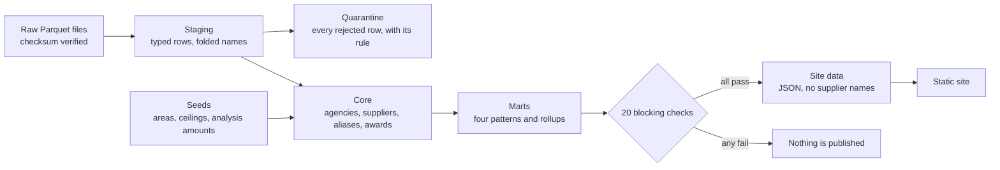

# Procurement Watch

A tested data pipeline over 5.48 million Philippine government procurement awards, and a static
site that shows what the records contain and what was done to them.

The pipeline takes the award notices published on PhilGEPS, as republished by BetterGov.PH,
cleans them, resolves agency and supplier names, computes four statistical patterns, and
publishes small pre-aggregated files for the site. Nothing is published unless every blocking
data check passes.

## What it found

- In 2024 there were 19,368 awards between ₱900,000 and ₱1,000,000 and 3,584 between
  ₱1,000,000 and ₱1,100,000. One million pesos was the ceiling for small value procurement.
- Awards cluster under every round number, so that ratio (5.4) is not meaningful alone. Round
  amounts with no rule attached sit at about 2.0. The ceiling is 2.7 times that baseline, up
  from 1.2 in 2010.
- ₱200,000, another ceiling, shows no excess over the baseline.
- ₱5,000,000 was first treated as a no-rule amount and spiked like a ceiling. No rule on file
  explains it: an advertising requirement at that amount ended in 2018, and the bunching grew
  after 2021. It is reported as unexplained and kept out of the baseline.
- The ceiling moved to ₱2,000,000 in February 2025. Bunching has not visibly moved with it yet.
- Nearly half of the raw 2025 value was the same records repeated, some more than 50 times.

These are descriptions of published records. A pattern is a reason to look closer. It is not
evidence of wrongdoing by any agency.

## How it is built



| Layer | What it holds |
|---|---|
| Raw | The source files, untouched, verified against `seeds/raw_manifest.json` |
| Staging | One typed row per raw row, each tagged with the first rule it fails |
| Quarantine | Rows that failed a rule. Raw always equals kept plus quarantined, per year |
| Core | Resolved agencies and suppliers, the alias table, awards, ceilings |
| Marts | Bunching, the 2025 rule change, same-day groups, supplier concentration, rollups |

Everything runs in DuckDB from plain SQL files in `sql/`. Name folding and supplier matching
are plain Python, because a DuckDB Python function did the same work about 100 times slower.

## Design decisions

**Nothing is dropped silently.** A row that fails a rule goes to quarantine with the rule's
name, and a check proves the counts reconcile.

**Placebos before conclusions.** Every ceiling is compared against round amounts with no rule.
That comparison removed one apparent finding (₱200,000) and exposed an amount that behaves
like a ceiling without a known rule (₱5,000,000).

**Rules, not similarity scores, for supplier names.** Each merge records the rule that caused
it. Scored on 300 sampled name pairs: no wrong merges, 70% of true matches found. The rules
were adjusted once after seeing that sample, so a fresh sample would score somewhat lower.

**Agencies are named, suppliers are not.** Agencies are public bodies. Suppliers are often
small businesses, and matching is imperfect. A test fails the build if a supplier name or id
reaches the published files.

**Tests are tested.** The suite is checked by deliberately breaking the code and confirming a
test fails. Several tests that passed while proving nothing were found and replaced this way.

## What the data cannot show

The source has no bidder counts, no procurement method, no approved budget and no supplier
identifier. Single-bidder analysis and bid-versus-budget comparisons are not possible. Most
2025 records lack a reference number, which removes them from the same-day pattern.

## Running it

```bash
python -m venv .venv
.venv/Scripts/python -m pip install -e ".[dev]"   # on Linux or macOS: .venv/bin/python
python -m pytest -q
python -m pw fetch          # download the pinned snapshot, about 500 MB
python -m pw build          # rebuild every table and run the data checks, under a minute
python -m pw eval-matching  # score supplier matching against the labelled pairs
python -m pw export         # write the site data, refused if a blocking check failed
python -m http.server 8123 --directory site
```

`python -m pw build` exits with an error if a blocking check fails. Running it twice gives
identical output.

## Layout

```
pw/         pipeline, checks, name folding, matching, evaluation, export
sql/        staging, quarantine, core and mart definitions
seeds/      reviewed reference data: areas, ceilings, analysis amounts, labelled name pairs
tests/      unit tests on small fixture files
site/       static pages, charts and styles; site/data is generated
```

## Source and licence of the data

Award records: PhilGEPS, republished by BetterGov.PH as `bettergovph/philgeps-data` under
CC0 1.0. This project pins one revision of that dataset.
